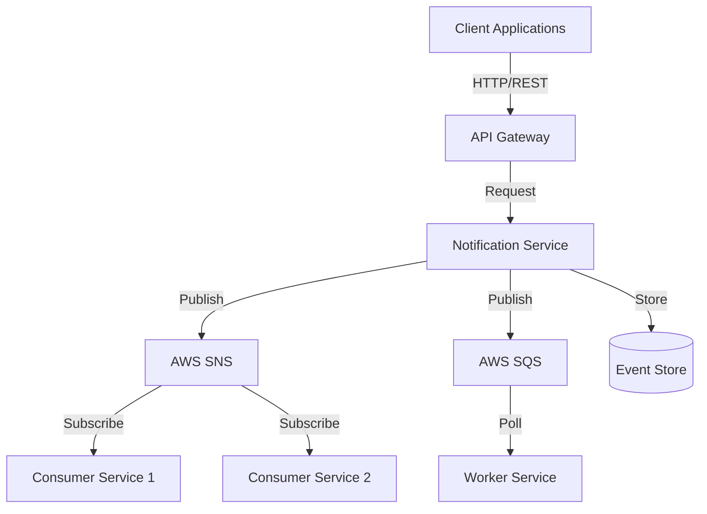
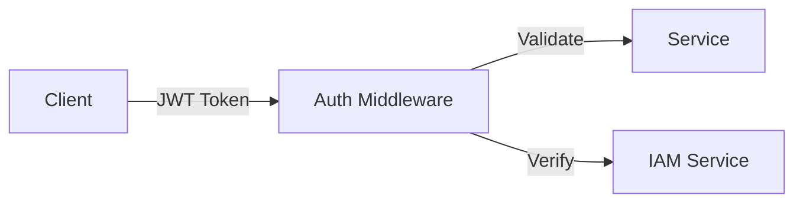
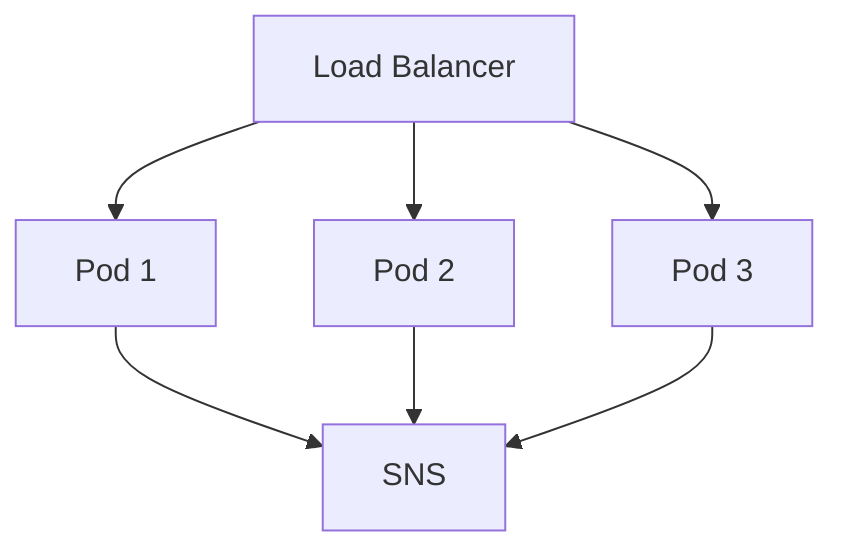

# Notification Service Architecture

## Overview

The Notification Service is a scalable, event-driven microservice designed to handle various types of notifications across different channels. It provides a unified interface for sending notifications while abstracting the underlying provider implementations.

## System Architecture

### High-Level Architecture



### Core Components

1. **API Layer**
   - REST API endpoints for notification requests
   - Request validation and sanitization
   - Authentication and authorization
   - Rate limiting and throttling

2. **Service Layer**
   - Business logic implementation
   - Event processing and routing
   - Provider adapter management
   - Error handling and retries

3. **Provider Adapters**
   - SNS adapter for AWS SNS integration
   - SQS adapter for AWS SQS integration
   - Extensible design for future providers

4. **Event Store**
   - Notification event persistence
   - Audit trail and compliance
   - Event replay capability

## Design Patterns

### Provider Adapter Pattern
```typescript
interface INotificationProvider {
    initialize(): Promise<void>;
    send(event: NotificationEvent): Promise<NotificationResult>;
    validateConfig(): Promise<boolean>;
}

class SNSProvider implements INotificationProvider {
    // Implementation for AWS SNS
}

class SQSProvider implements INotificationProvider {
    // Implementation for AWS SQS
}
```

### Event-Driven Architecture
```typescript
interface NotificationEvent<T = Record<string, unknown>> {
    id: string;
    type: string;
    version: string;
    timestamp: string;
    source: string;
    tenant: TenantInfo;
    metadata?: EventMetadata;
    data: T;
}
```

### Factory Pattern
```typescript
class NotificationProviderFactory {
    static createProvider(type: string): INotificationProvider {
        switch (type) {
            case 'sns':
                return new SNSProvider();
            case 'sqs':
                return new SQSProvider();
            default:
                throw new Error(`Unsupported provider type: ${type}`);
        }
    }
}
```

## Data Flow

### Notification Request Flow

1. **Request Reception**
   ```mermaid
   sequenceDiagram
       Client->>+API: POST /notifications
       API->>+Controller: create(event)
       Controller->>+Service: processEvent(event)
       Service->>+Provider: send(event)
       Provider->>+SNS: publish(message)
       SNS-->>-Provider: messageId
       Provider-->>-Service: result
       Service-->>-Controller: response
       Controller-->>-API: 202 Accepted
       API-->>-Client: response
   ```

2. **Event Processing**
   - Validation of event payload
   - Enrichment with metadata
   - Provider selection and routing
   - Delivery attempt tracking

3. **Error Handling**
   - Retry mechanisms
   - Dead letter queues
   - Error logging and monitoring

## Technical Stack

### Core Technologies
- Node.js
- NestJS Framework
- TypeScript
- AWS SDK

### Infrastructure
- AWS SNS/SQS
- Docker
- Kubernetes/ECS
- AWS CloudWatch

### Development Tools
- ESLint
- Jest
- TypeDoc
- Swagger/OpenAPI

## Security Architecture

### Authentication & Authorization


### Data Security
1. **In Transit**
   - TLS 1.2+ for all API communications
   - VPC endpoints for AWS services
   - Network isolation

2. **At Rest**
   - Encryption of sensitive data
   - Secure credential storage
   - Data retention policies

### Access Control
- Role-based access control (RBAC)
- Tenant isolation
- Resource-level permissions

## Scalability & Performance

### Horizontal Scaling


### Performance Optimizations
1. **Caching**
   - Provider configuration caching
   - Topic ARN caching
   - Connection pooling

2. **Batch Processing**
   - Message batching for SNS/SQS
   - Bulk operations support
   - Concurrent processing

3. **Resource Management**
   - Connection limits
   - Thread pool management
   - Memory optimization

## Monitoring & Observability

### Metrics
```typescript
interface ServiceMetrics {
    requestCount: Counter;
    errorRate: Gauge;
    processingTime: Histogram;
    providerLatency: Histogram;
}
```

### Logging
- Structured JSON logging
- Correlation IDs
- Log levels and sampling

### Tracing
- Distributed tracing
- Request context propagation
- Performance profiling

## Error Handling

### Error Hierarchy
```typescript
class BaseError extends Error {
    constructor(
        message: string,
        public code: string,
        public category: ErrorCategory,
        public type: ErrorType
    ) {
        super(message);
    }
}

class NotificationError extends BaseError {
    constructor(
        message: string,
        code: string,
        public originalError?: Error,
        public requestId?: string
    ) {
        super(message, code, ErrorCategory.SERVER, ErrorType.TECHNICAL);
    }
}
```

### Error Categories
1. **Validation Errors**
   - Invalid event format
   - Missing required fields
   - Schema violations

2. **Provider Errors**
   - Connection failures
   - Rate limiting
   - Authentication issues

3. **System Errors**
   - Resource exhaustion
   - Network timeouts
   - Internal failures

## Configuration Management

### Environment Configuration
```typescript
interface AppConfig {
    port: number;
    environment: string;
    provider: {
        type: string;
        config: Record<string, unknown>;
    };
    aws: {
        region: string;
        credentials: AWSCredentials;
    };
}
```

### Feature Flags
- Provider selection
- Retry policies
- Monitoring levels

## Testing Strategy

### Test Types
1. **Unit Tests**
   - Business logic
   - Data validation
   - Error handling

2. **Integration Tests**
   - Provider integration
   - API endpoints
   - Event processing

3. **Performance Tests**
   - Load testing
   - Stress testing
   - Scalability verification

## Future Enhancements

### Planned Features
1. **Additional Providers**
   - Email providers
   - SMS providers
   - Push notification services

2. **Enhanced Monitoring**
   - Real-time dashboards
   - Anomaly detection
   - Automated alerting

3. **Advanced Features**
   - Message templating
   - Dynamic routing
   - A/B testing support

## References

### Documentation
- [API Documentation](../api/endpoints.md)
- [Error Handling Guide](../api/error-handling.md)
- [Event Types](../schemas/event-types.md)

### External Resources
- [NestJS Documentation](https://docs.nestjs.com/)
- [AWS SNS Documentation](https://docs.aws.amazon.com/sns/)
- [AWS SQS Documentation](https://docs.aws.amazon.com/sqs/) 