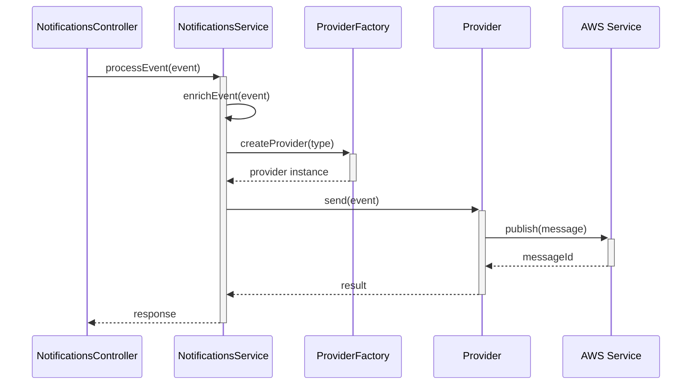
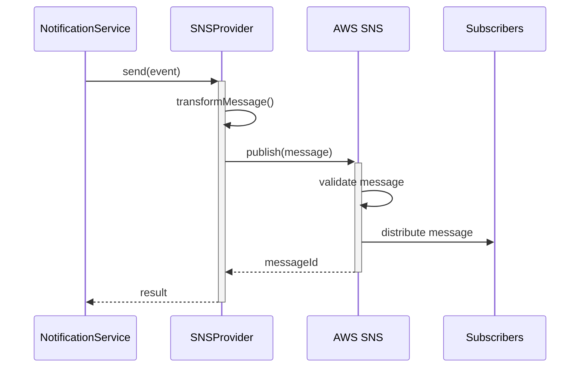
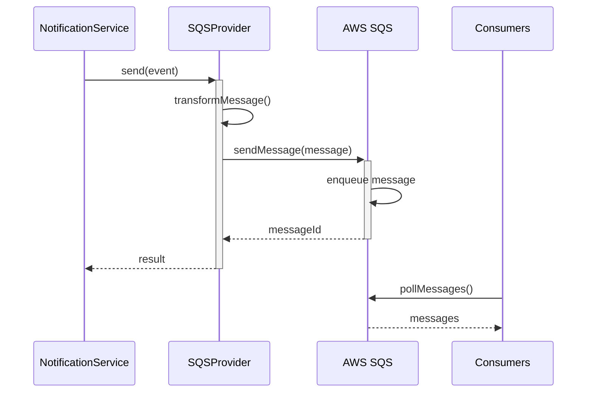
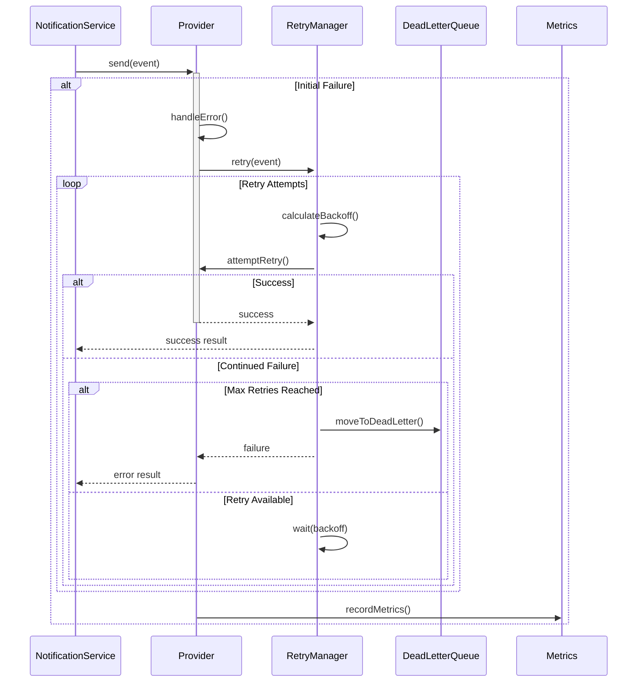
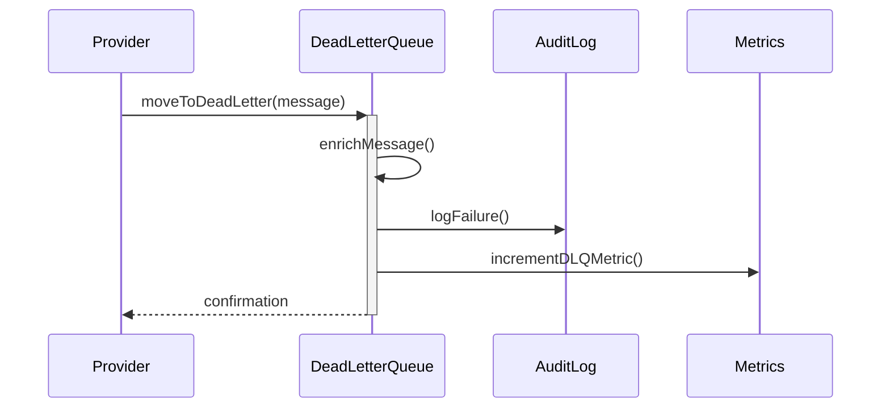
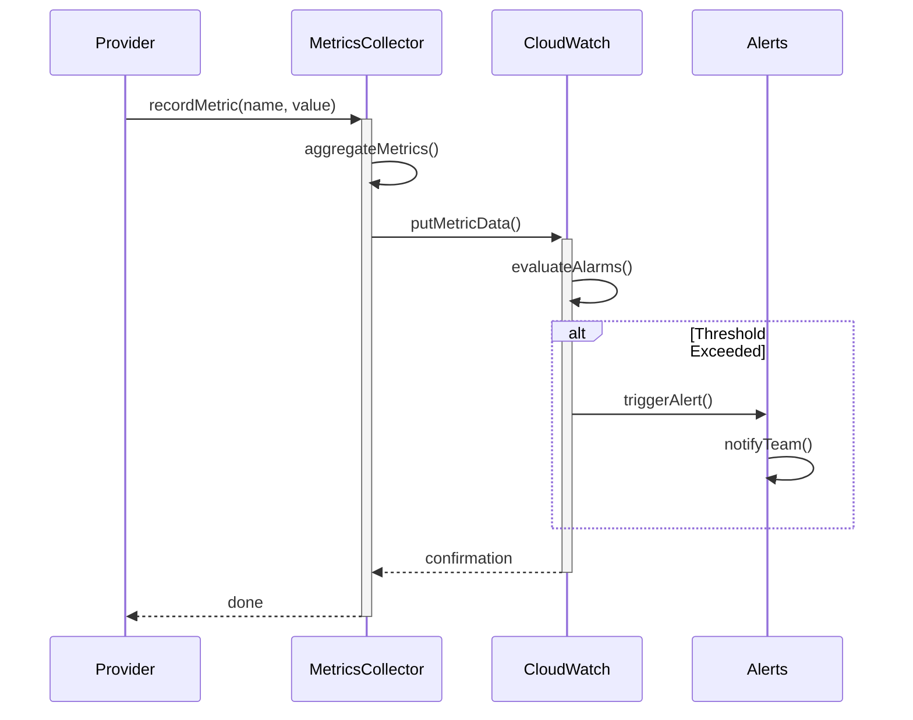
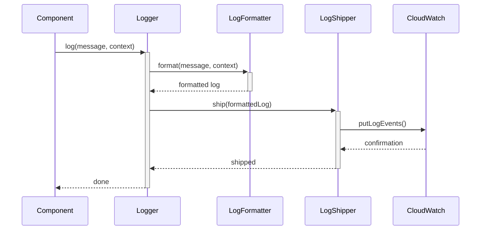

# Data Flow Architecture

## Overview
This document details the data flow within the Notification Service, from request reception to message delivery and response handling.

## Request Flow

### 1. Request Reception and Validation

```mermaid
sequenceDiagram
    participant C as Client
    participant API as API Gateway
    participant NC as NotificationsController
    participant VS as ValidationService

    C->>+API: POST /notifications
    API->>+NC: Forward Request
    NC->>+VS: validateEvent(event)
    
    alt Valid Event
        VS-->>-NC: Validation Success
        NC->>NC: Process Event
    else Invalid Event
        VS-->>-NC: Validation Errors
        NC-->>-API: 400 Bad Request
        API-->>-C: Error Response
    end
```

### 2. Event Processing Flow



## Data Transformation

### 1. Event Enrichment
```typescript
interface EventEnrichment {
    // Original event
    originalEvent: NotificationEvent;

    // Enrichment steps
    steps: {
        // Add timestamps
        addTimestamps(): void;
        
        // Add correlation IDs
        addCorrelationIds(): void;
        
        // Add routing information
        addRoutingInfo(): void;
        
        // Add tenant context
        addTenantContext(): void;
    };

    // Validation
    validate(): ValidationResult;
}
```

### 2. Provider Message Transformation
```typescript
interface MessageTransformation {
    // Transform for SNS
    toSNSMessage(): {
        TopicArn: string;
        Message: string;
        MessageAttributes: Record<string, MessageAttributeValue>;
    };

    // Transform for SQS
    toSQSMessage(): {
        QueueUrl: string;
        MessageBody: string;
        MessageAttributes: Record<string, MessageAttributeValue>;
    };
}
```

## Message Flow

### 1. SNS Publishing Flow



### 2. SQS Publishing Flow



## Error Flow

### 1. Error Handling and Retry Flow



### 2. Dead Letter Queue Flow



## Data Storage

### 1. Event Storage
```typescript
interface EventStorage {
    // Store event
    store(event: NotificationEvent): Promise<void>;

    // Retrieve event
    retrieve(eventId: string): Promise<NotificationEvent>;

    // List events
    list(filters: EventFilters): Promise<NotificationEvent[]>;

    // Delete event
    delete(eventId: string): Promise<void>;
}
```

### 2. Audit Trail
```typescript
interface AuditTrail {
    // Log event
    logEvent(event: NotificationEvent): Promise<void>;

    // Log error
    logError(error: Error, context: ErrorContext): Promise<void>;

    // Log metrics
    logMetrics(metrics: EventMetrics): Promise<void>;

    // Query audit trail
    query(filters: AuditFilters): Promise<AuditEntry[]>;
}
```

## Monitoring Flow

### 1. Metrics Collection



### 2. Logging Flow



## Security Flow

### 1. Authentication Flow

```mermaid
sequenceDiagram
    participant C as Client
    participant AG as API Gateway
    participant AM as AuthMiddleware
    participant TS as TokenService
    participant NC as NotificationsController

    C->>+AG: Request + Token
    AG->>+AM: Authenticate
    AM->>+TS: validateToken()
    
    alt Valid Token
        TS-->>-AM: Valid
        AM->>NC: Forward Request
    else Invalid Token
        TS-->>-AM: Invalid
        AM-->>-AG: 401 Unauthorized
        AG-->>-C: Error Response
    end
```

### 2. Authorization Flow

```mermaid
sequenceDiagram
    participant AM as AuthMiddleware
    participant AC as AccessControl
    participant TC as TenantContext
    participant NC as NotificationsController

    AM->>+AC: checkPermissions(user, resource)
    AC->>+TC: validateTenant()
    
    alt Valid Access
        TC-->>-AC: Valid
        AC-->>-AM: Authorized
        AM->>NC: Forward Request
    else Invalid Access
        TC-->>-AC: Invalid
        AC-->>-AM: Denied
        AM->>AM: Return 403
    end
```

## References

### Internal Documentation
- [API Documentation](../api/endpoints.md)
- [Error Handling](../api/error-handling.md)
- [Event Types](../schemas/event-types.md)

### External Documentation
- [AWS SNS Developer Guide](https://docs.aws.amazon.com/sns/latest/dg/welcome.html)
- [AWS SQS Developer Guide](https://docs.aws.amazon.com/AWSSimpleQueueService/latest/SQSDeveloperGuide/welcome.html)
- [NestJS Documentation](https://docs.nestjs.com/) 