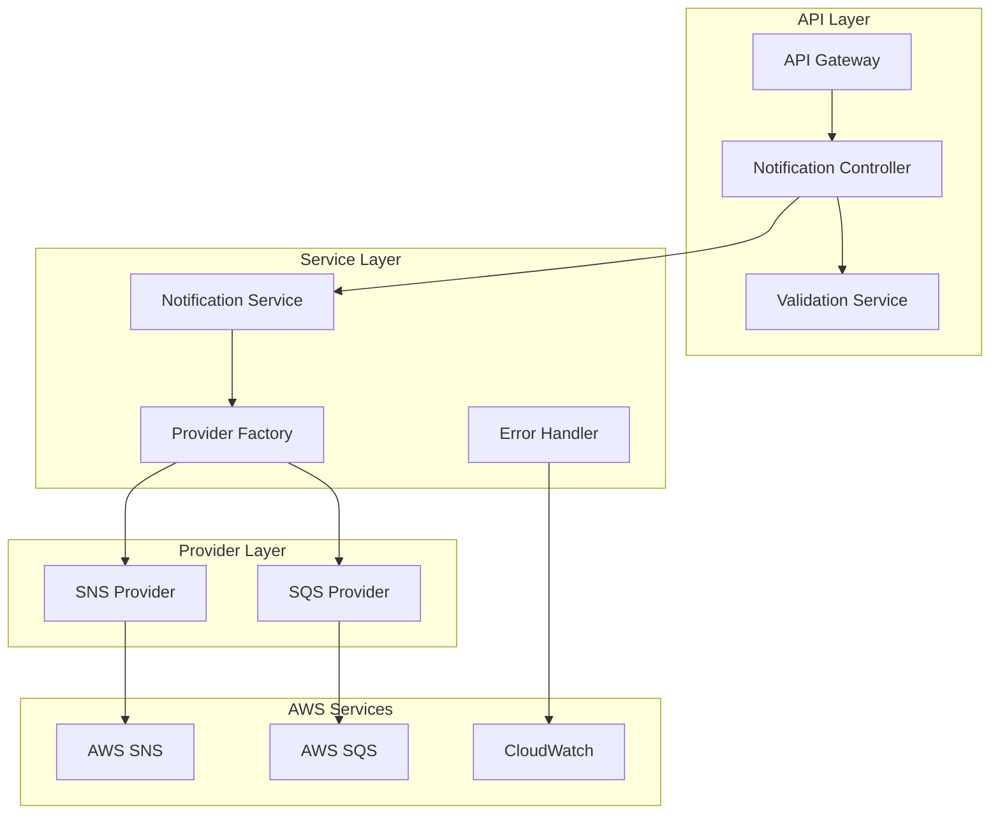
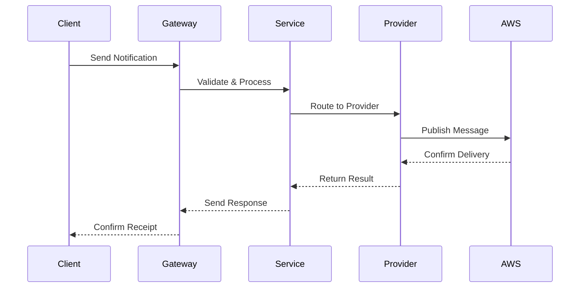
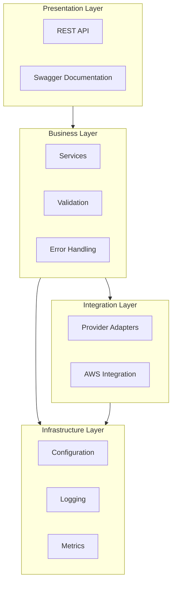
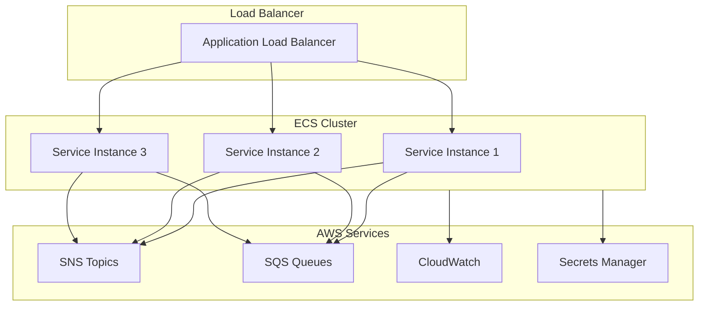

# High-Level Architecture Overview

## Introduction

The Notification Service is a scalable, event-driven microservice designed to handle various types of notifications through multiple providers. It serves as a central hub for processing and routing notifications while maintaining high reliability, scalability, and extensibility.

## System Components

### 1. Core Service Components



### 2. Data Flow Architecture



## Key Features

### 1. Event Processing
- Validation and sanitization of incoming events
- Event enrichment with metadata
- Dynamic routing based on event type
- Delivery tracking and confirmation

### 2. Provider Management
- Pluggable provider architecture
- Provider-specific configuration
- Connection pooling and caching
- Automatic failover and retry logic

### 3. Error Handling
- Comprehensive error categorization
- Structured error responses
- Retry mechanisms with backoff
- Dead letter queue integration

### 4. Monitoring & Observability
- Real-time metrics collection
- Structured logging
- Distributed tracing
- Health check endpoints

## Technical Architecture

### 1. Application Layers



### 2. Deployment Architecture



## Security Architecture

### 1. Authentication & Authorization
- API key validation
- JWT token verification
- Role-based access control
- Tenant isolation

### 2. Data Security
- TLS encryption in transit
- AWS KMS integration
- Secrets management
- Audit logging

### 3. Network Security
- VPC configuration
- Security groups
- Network ACLs
- WAF integration

## Scalability & Performance

### 1. Horizontal Scaling
- Auto-scaling groups
- Load balancing
- Connection pooling
- Caching strategies

### 2. Performance Optimization
- Message batching
- Asynchronous processing
- Resource pooling
- Query optimization

## Monitoring & Alerting

### 1. Metrics Collection
```typescript
interface ServiceMetrics {
    // Request metrics
    requestCount: Counter;
    requestLatency: Histogram;
    requestSize: Histogram;

    // Provider metrics
    providerLatency: Histogram;
    providerErrors: Counter;
    providerRetries: Counter;

    // System metrics
    cpuUsage: Gauge;
    memoryUsage: Gauge;
    activeConnections: Gauge;
}
```

### 2. Alert Configuration
```typescript
interface AlertConfig {
    // Error rate alerts
    errorRateThreshold: number;
    errorRateWindow: number;

    // Latency alerts
    latencyThreshold: number;
    latencyPercentile: number;

    // Resource alerts
    cpuThreshold: number;
    memoryThreshold: number;
}
```

## Configuration Management

### 1. Environment Configuration
```typescript
interface EnvironmentConfig {
    // Application settings
    port: number;
    nodeEnv: string;
    logLevel: string;

    // AWS configuration
    awsRegion: string;
    awsEndpoint?: string;

    // Provider settings
    defaultProvider: string;
    providerConfigs: Record<string, ProviderConfig>;

    // Topic mappings
    topicMappings: Record<string, string>;
}
```

### 2. Feature Flags
```typescript
interface FeatureFlags {
    // Provider features
    enableSNS: boolean;
    enableSQS: boolean;

    // Operational features
    enableRetries: boolean;
    enableBatching: boolean;
    enableCaching: boolean;

    // Monitoring features
    enableTracing: boolean;
    enableMetrics: boolean;
}
```

## Disaster Recovery

### 1. Backup Strategy
- Configuration backups
- Infrastructure state backups
- Event log backups
- Audit trail preservation

### 2. Recovery Procedures
- Provider failover
- Region failover
- Service restoration
- Data recovery

## Future Enhancements

### 1. Technical Improvements
- GraphQL API support
- WebSocket notifications
- Event sourcing
- CQRS pattern implementation

### 2. Operational Improvements
- Automated deployment pipeline
- Chaos engineering integration
- Performance optimization
- Enhanced monitoring

## References

### Internal Documentation
- [API Documentation](../api/endpoints.md)
- [Deployment Guide](../guides/deployment/deployment-guide.md)
- [Development Setup](../guides/setup/development-setup.md)

### External Documentation
- [NestJS Documentation](https://docs.nestjs.com/)
- [AWS SNS Documentation](https://docs.aws.amazon.com/sns/)
- [AWS SQS Documentation](https://docs.aws.amazon.com/sqs/) 