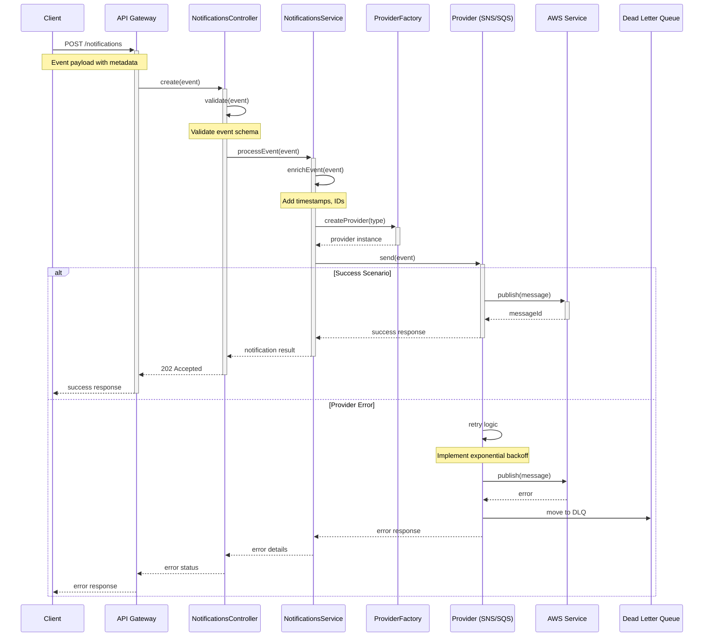
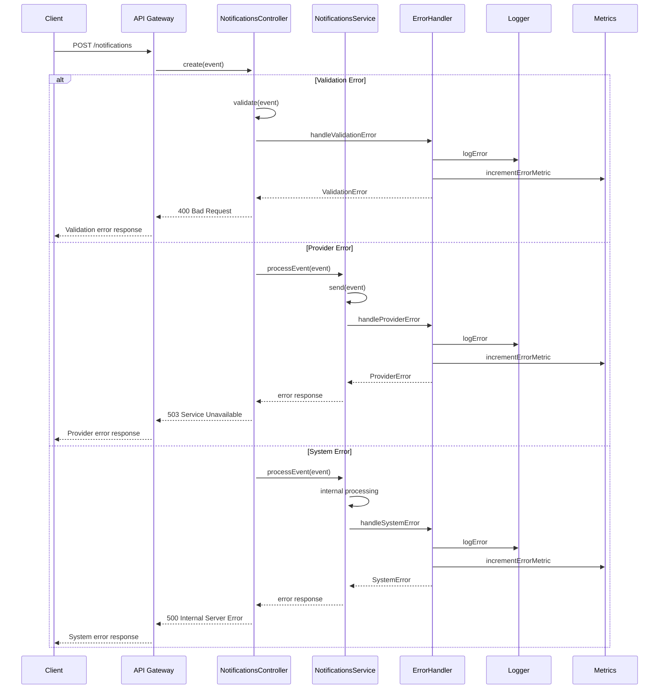
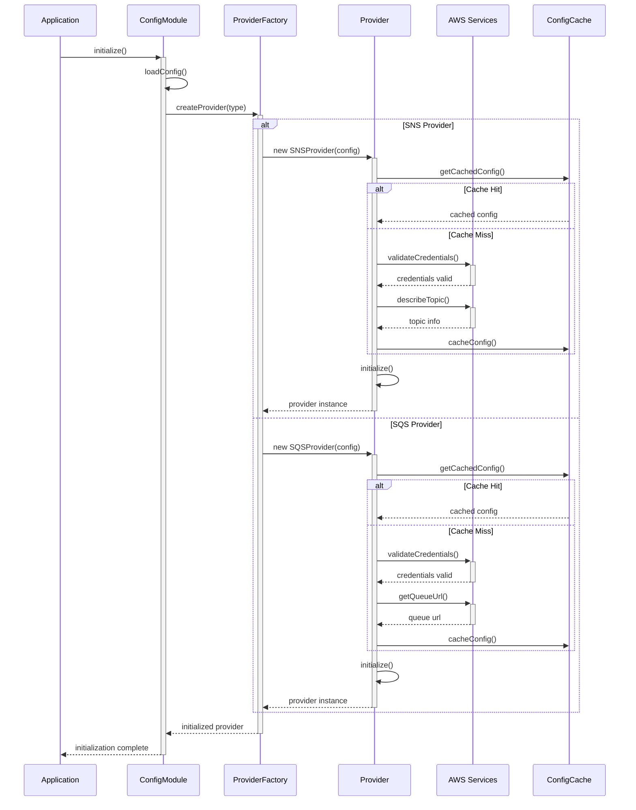
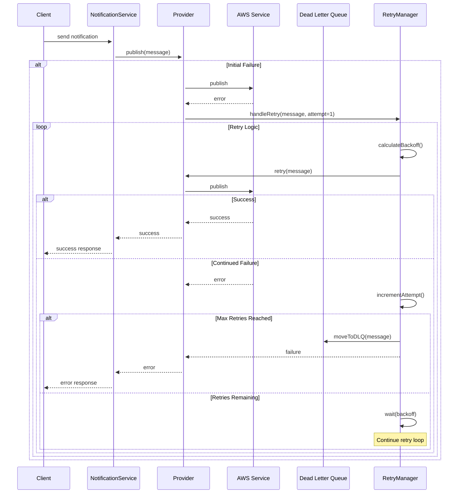
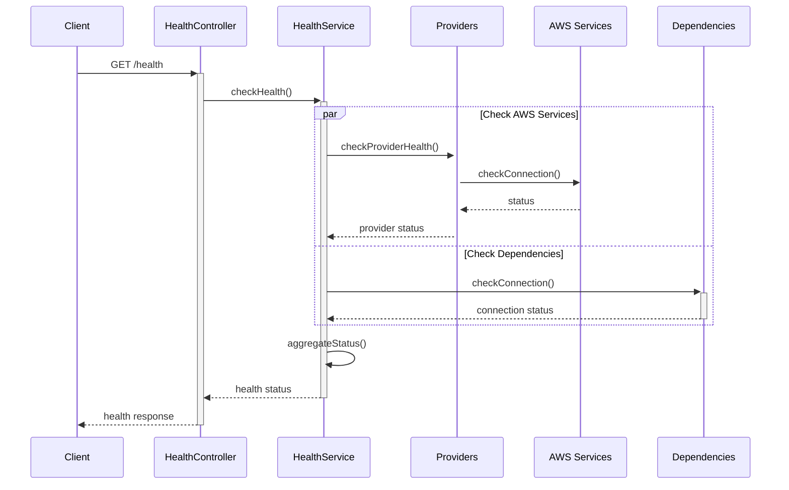
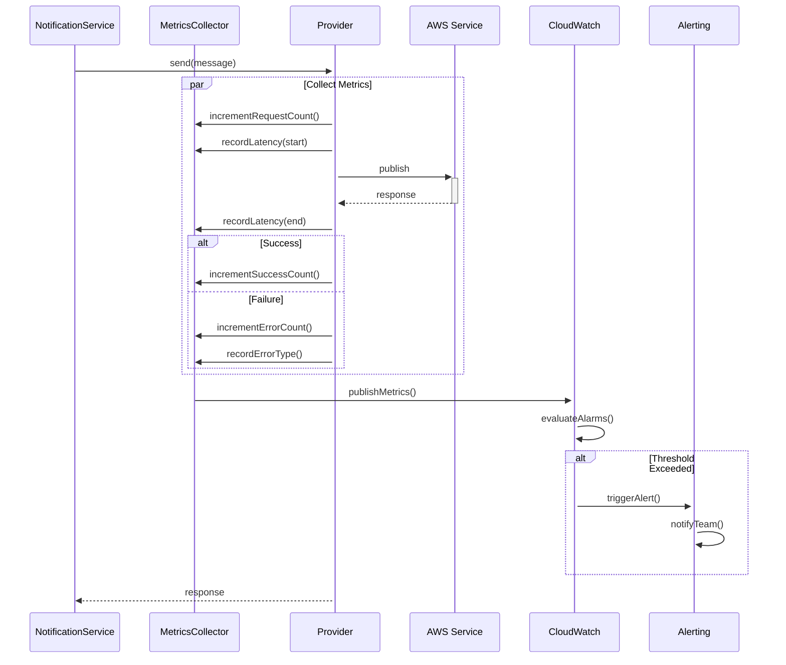

# Notification Service Sequence Diagrams

## Overview
This document provides detailed sequence diagrams illustrating the various flows within the Notification Service.

## Notification Processing Flow

## Error Handling Flow

## Provider Initialization Flow

## Retry and Recovery Flow

## Health Check Flow

## Monitoring and Metrics Flow

