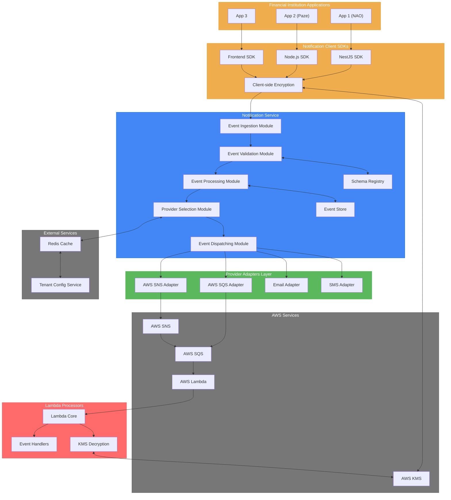

```mermaid
flowchart TD
    subgraph FinApps["Financial Institution Applications"]
        AppNAO["App 1 (NAO)"]
        AppPaze["App 2 (Paze)"]
        AppOther["App 3"]
    end
    
    subgraph SDKs["Notification Client SDKs"]
        NestjsSDK["NestJS SDK"]
        NodeSDK["Node.js SDK"]
        FrontendSDK["Frontend SDK"]
        SDKEncryption["Client-side Encryption"]
    end
    
    subgraph NotificationService["Notification Service"]
        EventIngestion["Event Ingestion Module"]
        EventValidation["Event Validation Module"]
        EventProcessing["Event Processing Module"]
        ProviderSelection["Provider Selection Module"]
        EventDispatching["Event Dispatching Module"]
        EventStore["Event Store"]
        SchemaRegistry["Schema Registry"]
    end
    
    subgraph ProviderAdapters["Provider Adapters Layer"]
        AWSSNS["AWS SNS Adapter"]
        AWSSQS["AWS SQS Adapter"]
        EmailAdapter["Email Adapter"]
        SMSAdapter["SMS Adapter"]
    end
    
    subgraph AWSServices["AWS Services"]
        SNS["AWS SNS"]
        SQS["AWS SQS"]
        Lambda["AWS Lambda"]
        KMS["AWS KMS"]
    end
    
    subgraph ExternalServices["External Services"]
        ConfigService["Tenant Config Service"]
        Redis["Redis Cache"]
    end
    
    subgraph LambdaProcessors["Lambda Processors"]
        ProcessorCore["Lambda Core"]
        ProcessorHandlers["Event Handlers"]
        LambdaKMS["KMS Decryption"]
    end
    
    AppNAO --> NestjsSDK
    AppPaze --> NodeSDK
    AppOther --> FrontendSDK
    
    NestjsSDK --> SDKEncryption
    NodeSDK --> SDKEncryption
    FrontendSDK --> SDKEncryption
    
    SDKEncryption <--> KMS
    SDKEncryption --> EventIngestion
    
    EventIngestion --> EventValidation
    EventValidation --> EventProcessing
    EventProcessing --> ProviderSelection
    ProviderSelection --> EventDispatching
    
    EventValidation <--> SchemaRegistry
    ProviderSelection <--> Redis
    Redis <--> ConfigService
    EventProcessing <--> EventStore
    
    EventDispatching --> AWSSNS
    EventDispatching --> AWSSQS
    EventDispatching --> EmailAdapter
    EventDispatching --> SMSAdapter
    
    AWSSNS --> SNS
    AWSSQS --> SQS
    
    SNS --> SQS
    SQS --> Lambda
    
    Lambda --> ProcessorCore
    ProcessorCore --> ProcessorHandlers
    ProcessorCore --> LambdaKMS
    LambdaKMS <--> KMS
    
    classDef primary fill:#4287f5,stroke:#0066cc,color:white
    classDef secondary fill:#5cb85c,stroke:#4cae4c,color:white
    classDef tertiary fill:#f0ad4e,stroke:#eea236,color:white
    classDef external fill:#777777,stroke:#555555,color:white
    classDef lambda fill:#ff6b6b,stroke:#e06363,color:white
    
    class NotificationService primary
    class ProviderAdapters secondary
    class SDKs tertiary
    class FinApps tertiary
    class AWSServices,ExternalServices external
    class LambdaProcessors lambda
```