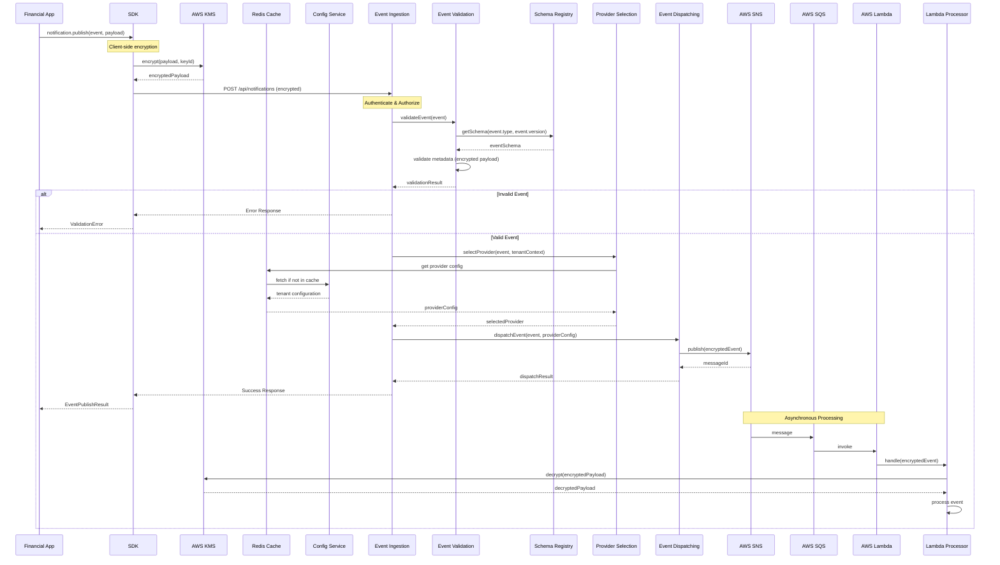

```mermaid
sequenceDiagram
    participant App as Financial App
    participant SDK as SDK
    participant KMS as AWS KMS
    participant Redis as Redis Cache
    participant ConfigSvc as Config Service
    participant Ingestion as Event Ingestion
    participant Validation as Event Validation
    participant Registry as Schema Registry
    participant Selection as Provider Selection
    participant Dispatch as Event Dispatching
    participant SNS as AWS SNS
    participant SQS as AWS SQS
    participant Lambda as AWS Lambda
    participant Processor as Lambda Processor
    
    App->>SDK: notification.publish(event, payload)
    
    Note over SDK: Client-side encryption
    SDK->>KMS: encrypt(payload, keyId)
    KMS-->>SDK: encryptedPayload
    
    SDK->>Ingestion: POST /api/notifications (encrypted)
    
    Note over Ingestion: Authenticate & Authorize
    
    Ingestion->>Validation: validateEvent(event)
    Validation->>Registry: getSchema(event.type, event.version)
    Registry-->>Validation: eventSchema
    Validation->>Validation: validate metadata (encrypted payload)
    Validation-->>Ingestion: validationResult
    
    alt Invalid Event
        Ingestion-->>SDK: Error Response
        SDK-->>App: ValidationError
    else Valid Event
        Ingestion->>Selection: selectProvider(event, tenantContext)
        Selection->>Redis: get provider config
        Redis->>ConfigSvc: fetch if not in cache
        ConfigSvc-->>Redis: tenant configuration
        Redis-->>Selection: providerConfig
        Selection-->>Ingestion: selectedProvider
        
        Ingestion->>Dispatch: dispatchEvent(event, providerConfig)
        Dispatch->>SNS: publish(encryptedEvent)
        SNS-->>Dispatch: messageId
        Dispatch-->>Ingestion: dispatchResult
        
        Ingestion-->>SDK: Success Response
        SDK-->>App: EventPublishResult
        
        Note over SNS,Lambda: Asynchronous Processing
        SNS->>SQS: message
        SQS->>Lambda: invoke
        Lambda->>Processor: handle(encryptedEvent)
        Processor->>KMS: decrypt(encryptedPayload)
        KMS-->>Processor: decryptedPayload
        Processor->>Processor: process event
    end
```